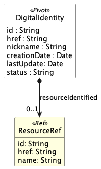

# GraphQL vs. Rest - TMF APis

This is the GitHub-project for my implementation to my bachelor thesis where I compare the implementation of TMF-APIs in REST and GraphQL 

## Prerequisites

Before executing this project, make sure that the following tools are installed:

- [Node.js](https://nodejs.org/en/) (Version 14.x oder höher)
- [MongoDB](https://www.mongodb.com/) (Lokal oder gehostet)

## Installation

1. **Clone the Repository**:
   ```bash
   git clone https://github.com/laurenzhbr/graphql-mongodb.git

2. **setup server**
    ```bash
    cd graphql-mongodb/server
    npm install && npm start

3. **setup client**
    ```bash
    cd graphql-mongodb/client
    npm install
    node client

## Starting the Test-Suite
### Prerequisite is having set up the client and server

1. **mock DB data**
    ```bash
    ./setup-data.sh {db_name}

2. **start testsuite**
    ```bash
    ./run-testsuite.sh {db_name}

# Data Models
## Overall Data Structure with all Pivot-Objects


## Data Model for "Resource"


## Data Model for "Digital Identity"


## Data Model for "Organization" (Party)


## Data Model for "GeographicAddress"


